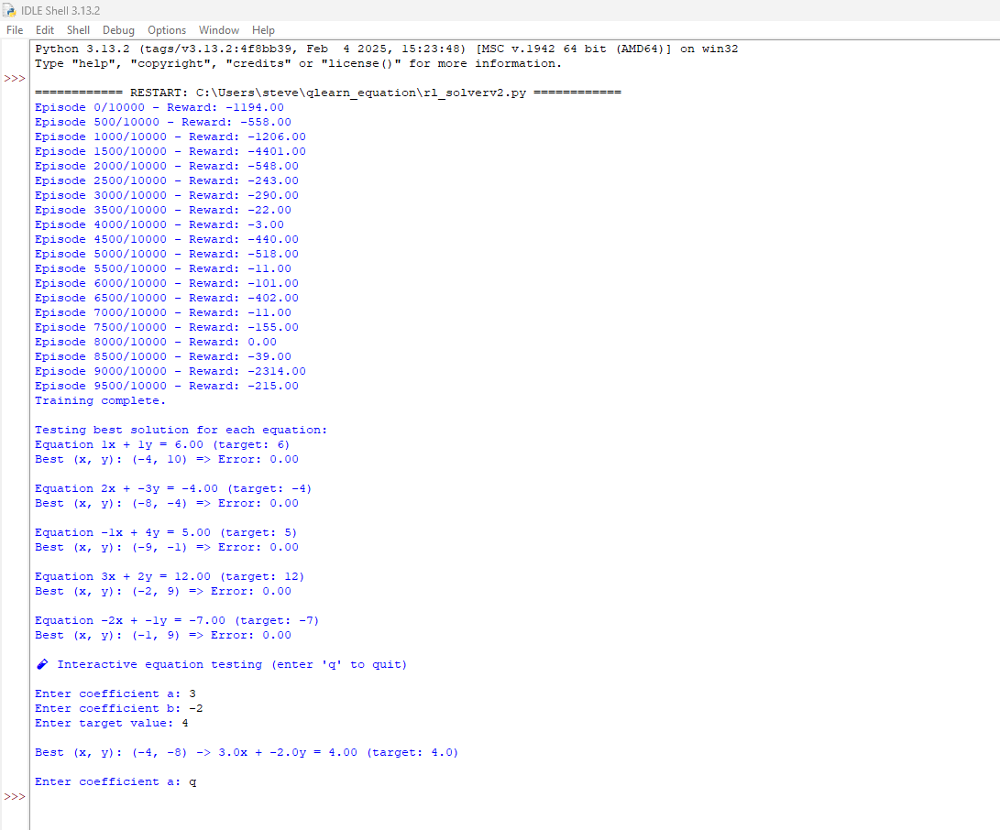
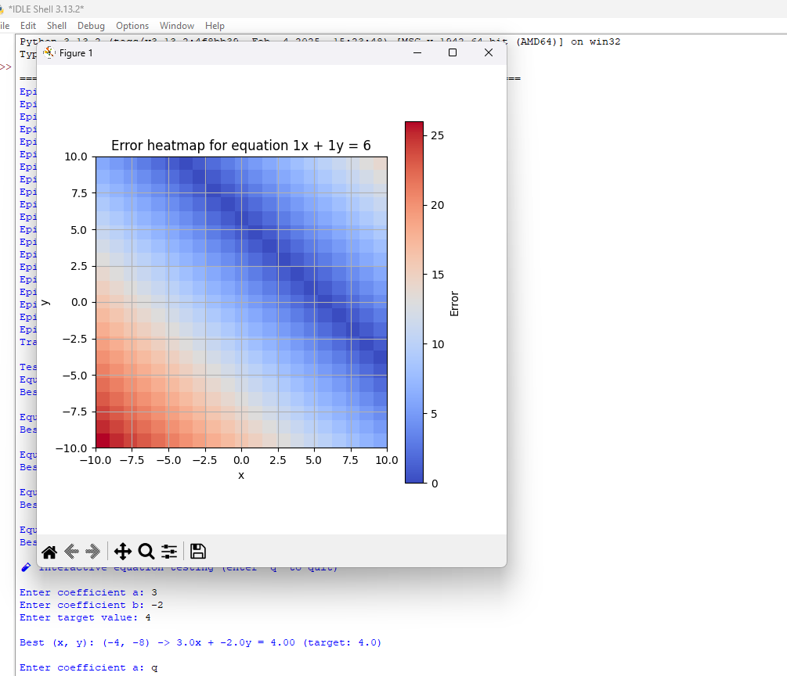

# Reinforcement-Learning-for-Solving-Linear-Equations
This project implements a reinforcement learning (RL) agent using Q-learning to solve linear equations of the form ax + by = c. The agent learns to minimize the error between the predicted and target values by navigating a grid of points and adjusting its (x, y) values. The code also includes testing and interactive modes for users to experiment with custom equations.

Features
Q-learning: The agent learns using Q-learning, adjusting its actions to minimize the error between its predictions and the target values of the equations.

Training: The agent explores different (x, y) values in the grid and receives rewards based on how close the predicted value is to the target.

Testing: After training, the agent identifies the best (x, y) pair for each equation that minimizes the prediction error.

Interactive Mode: Allows users to input their own coefficients and target values, and the agent will output the best (x, y) values.

Error Visualization: Generates heatmaps to visualize the prediction error for each equation across the grid.

Requirements
Python 3.x

numpy

matplotlib

You can install the required dependencies using pip:
pip install numpy matplotlib

Files
reinforcement_learning.py: Contains the code for the Q-learning agent, training, testing, and interactive modes.

README.md: This file.

Usage
1. Training the Agent
The agent is trained using the train() function. It learns by navigating a 2D grid of (x, y) values, adjusting its actions based on the error between predicted and target values.

To start the training, simply run:
train()
The agent will train for 10,000 episodes and output the reward at regular intervals.

2. Testing the Agent
After training, you can test the agent's performance on each equation by calling the test() function:
test()
This will output the best (x, y) values that minimize the error for each equation.

3. Interactive Testing
The interactive_test() function allows users to input custom coefficients and target values for the equation. The agent will then find and display the best (x, y) values.

Run the interactive mode with:
interactive_test()
You can exit the interactive mode by typing 'q' at any prompt.

4. Error Visualization
You can visualize the error grid for a specific equation using the show_graph(eq_idx) function. This will display a heatmap of prediction errors across the grid for the equation at the given index.

Example:
show_graph(0)  # Visualize error for the first equation
Equations Used
The agent works with the following set of linear equations:

x + y = 6

2x - 3y = -4

-x + 4y = 5

3x + 2y = 12

-2x - y = -7

These equations are stored in the equations list and can be modified for custom use.

Results
After training, the agent will output the best (x, y) pairs for each equation and the associated error. The heatmap generated by show_graph visually demonstrates where the agent's predictions are closest to the target.

License
This project is licensed under the MIT License - see the LICENSE file for details.